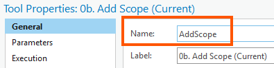

# convert_atbx_cmdlet
pwsh commandlet to unpack and pack an atbx

See help and examples in the cmdlet documentation.
- `Get-Help Convert-Atbx -Detailed`
- `Get-Help Pack-Atbx -Detailed`
- `Get-Help Unpack-Atbx -Detailed`

## Idea

The idea here is that the atbx is "unpacked" to `ATBX_MASTER` and tracked in git. A new .atbx file can be made by zipping the contents of ATBX_MASTER. Changes in the .atbx, such as those made via Arc's Catalog, can be unpacked **on top of** ATBX_MASTER to reveal what changed, and those change can be merged in normal git fashion. This is useful when the atbx is changed by non-devs, such as "feral" coders in production.

Furthermore, most atbx changes can be made directly on the files in ATBX_MASTER, as long as they maintain the atbx validity. It is even possibly to add new tools entirely from ATBX_MASTER.

This works well for adding, removing, and changing existing tools. The only snag so far is if the "Name" field of a tool changes.
    
This "Name" also controls the name of the folder within ATBX_MASTER. Changing this in Catalog, then unpacking the atbx will create what appears to be a "new" tool instead of changing the existing tool. Again, this is because of the folder name. If one is careful and changes the folder name (using `git mv`) and the tool name in the atbx's root `toolbox.content.rc`, then commit one should be able to change this property while maintaining git history.

## To "install"

1. clone the repo wherever you like.
2. source the cmdlet in your pwsh profile.
    1. edit your profile. ex: `code $PROFILE`.
    2. add line `. C:\...\convert_atbx_cmdlet\convert_atbx.ps1`.
    3. restart any shells or re-source your profile (ex: `. $PROFILE`).